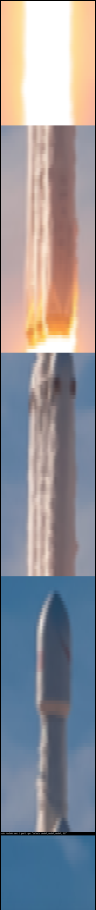

# Asciinema-Edit

_Rearrange and remove asciicast sections_

## Description

This script will allow you to cut out parts of your astiicast that you 
do not want. This may at some point be merged into asciinema.

## Example Usage

Use rocket.cast from the repo (also at https://asciinema.org/a/238491)
Let's pretend we like rocket animations, but in reverse. Let's split along
these sections: [0, 2.3], [2.3, 4], [4, 5.5], [5.5, 7], [7, 8.5].
And now reverse them:

    python asciicast-edit.py -r rocket.cast -w no_rocket.cast 
      -s 7 8.5 -s 5.5 7 -s 4 5.5 -s 2.3 4 -s 0 2.3 
  
The result is reversed_rocket.cast. It is a pretty funky looking rocket launch.

## LICENSE

Apache 2.0, see LICENSE for more information.